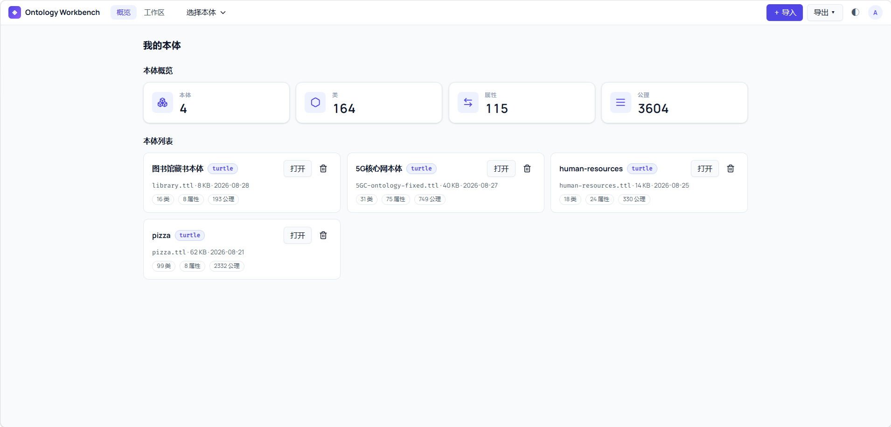
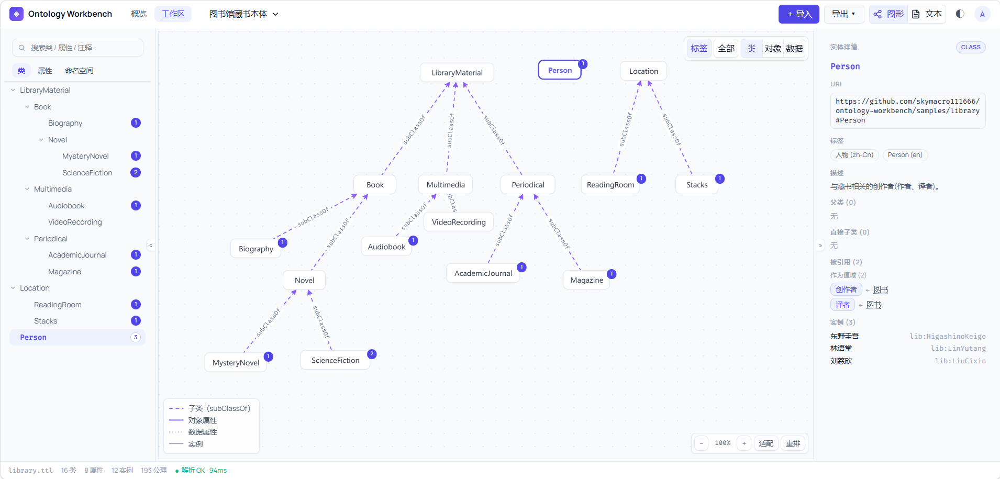
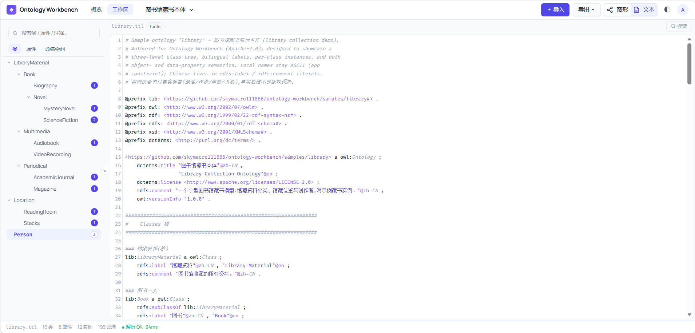

<div align="center">

# Ontology Workbench

**A self-hosted, open-source ontology workbench — explore, edit, and publish ontologies**

[](../../../actions/workflows/ci.yml)
[](../../../LICENSE)
[](README.en.md)
[](../../README.md)

[Features](#-features) · [Showcase](#-feature-showcase) · [Get Started](#-get-started) · [License](#-license)

</div>

## ✨ Features

- **Three-pane browsing** — class-tree, property, and prefix-URI sidebars plus instant search; silky-smooth virtualized scrolling even on huge ontologies
- **Smart graph visualization** — canvas hosts local-neighbor and global-overview graphs, edges colored by semantics, node positions remembered after dragging
- **Point-and-edit canvas** — right-click to create, edit, and delete classes and properties, no page-hopping needed
- **Integrated source editing** — built-in editor with full find-and-replace
- **Offline docs export** — generates a static site with zero external dependencies

## 📸 Feature Showcase

**Overview page**



**Graph mode**



**Source editing**



## 🚀 Get Started

### Option 1: Docker (recommended)

```bash
git clone https://github.com/skymacro111666/ontology-workbench.git
cd ontology-workbench
docker compose up -d --build
```

Open `http://127.0.0.1:8734`. Data is kept in the project-local `./data` and `./logs` directories and survives container rebuilds. `OW_PORT=9000 docker compose up -d` sets the port; if `OW_JWT_SECRET` is unset a secret is generated on first start and saved in `data/jwt-secret`.

### Option 2: From source

Prerequisites: Python ≥ 3.11, uv, Node.js ≥ 22, and npm.

```bash
git clone https://github.com/skymacro111666/ontology-workbench.git
cd ontology-workbench

# 1) backend deps
cd backend && uv sync

# 2) frontend build (the SPA is served by the backend on the same port)
cd ../frontend && npm ci && npm run build

# 3) start (auto-opens the browser on a loopback TTY; --no-browser disables)
cd ../backend && uv run ow serve
```

The first visit walks you through a one-time admin setup; log in and load a bundled sample ontology. **Config precedence: CLI flags > environment variables (`.env`) > defaults**; common variables are `OW_HOST` / `OW_PORT` / `OW_DATA_DIR` / `OW_DB_URL` (SQLite by default, PostgreSQL support coming soon) / `OW_LOG_LEVEL`; the docs-site export directory is confined to `{data dir}/exports/` unless `OW_EXPORT_ALLOW_ANY_PATH=1` opts out.

## 📄 License

[Apache License 2.0](../../LICENSE) · Copyright 2026 The Ontology Workbench Authors.
