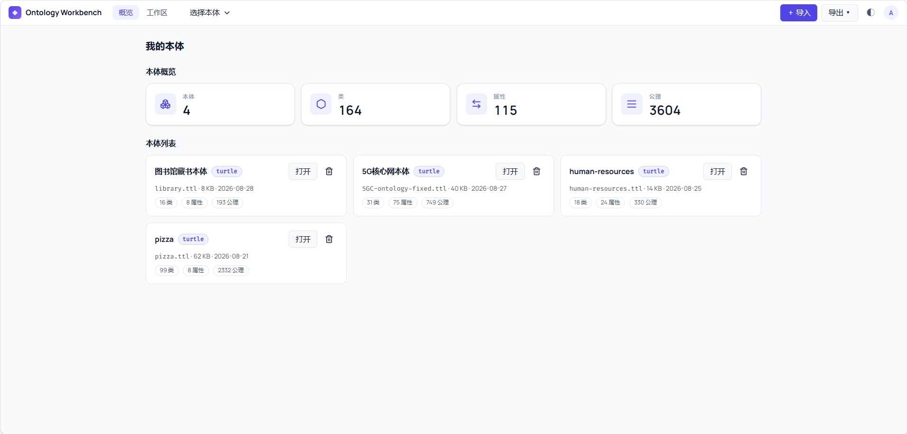
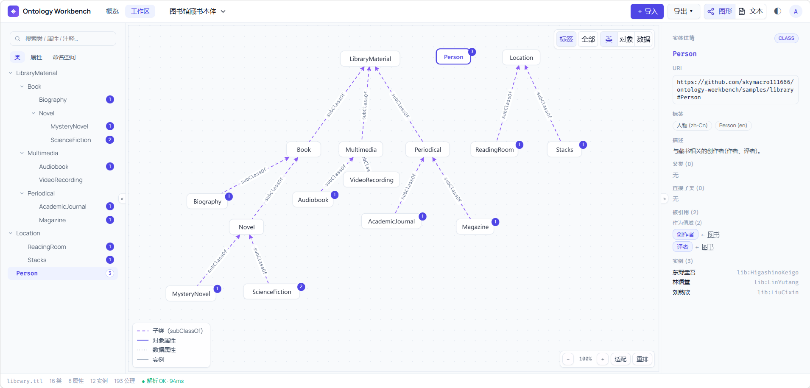
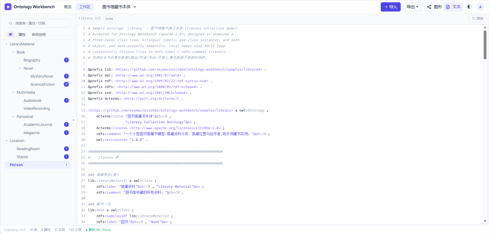

<div align="center">

# Ontology Workbench

**A self-hosted, open-source ontology workbench — explore, edit, and publish ontologies**

[](../../../actions/workflows/ci.yml)
[](../../../LICENSE)
[](README.en.md)
[](../../README.md)

[Features](#-features) · [Showcase](#-feature-showcase) · [Get Started](#-get-started) · [MCP](#-mcp) · [License](#-license)

</div>

## ✨ Features

- **Three-pane browsing** — class-tree, property, and prefix-URI sidebars plus instant search; silky-smooth virtualized scrolling even on huge ontologies
- **Smart graph visualization** — canvas hosts local-neighbor and global-overview graphs, edges colored by semantics, node positions remembered after dragging
- **Point-and-edit canvas** — right-click to create, edit, and delete classes and properties, no page-hopping needed
- **Progressive canvas display** — past 2000 live classes the overview auto-folds to the root view; switch back to the full view at any time
- **Blazing-fast incremental commits** — every edit patches the in-memory index at once (read-your-writes); the file lands via a debounced background save
- **Integrated source editing** — built-in source editor with full find-and-replace
- **Integrated SPARQL** — read-only queries with SELECT/ASK/CONSTRUCT support; IRIs auto-shortened to CURIEs
- **Integrated SHACL** — built-in and custom shapes run standard consistency validation against the ontology, reporting violations at violation/warning/info levels
- **OWL 2 compatible & profile-graded** — Manchester axiom rendering plus EL/QL/RL/DL profile detection (vocabulary-level approximation)
- **Offline docs export** — generates a static site with zero external dependencies
- **Built-in MCP** — an MCP server exposing 10 tools for agents to call on demand

## 📸 Feature Showcase

**Overview page**



**Graph mode**



**Source editing**



## 🚀 Get Started

### Option 1: Docker (recommended)

```bash
git clone https://github.com/skymacro111666/ontology-workbench.git
cd ontology-workbench
docker compose up -d --build
```

Open `http://<your-ip-address>:8734`. Data is kept in the project-local `./data` and `./logs` directories and survives container rebuilds. `OW_PORT=9000 docker compose up -d` sets the port; if `OW_JWT_SECRET` is unset a secret is generated on first start and saved in `data/jwt-secret`.

### Option 2: From source

Prerequisites: Python ≥ 3.11, uv, Node.js ≥ 22, and npm.

```bash
git clone https://github.com/skymacro111666/ontology-workbench.git
cd ontology-workbench

# 1) backend deps
cd backend && uv sync

# 2) frontend build (the SPA is served by the backend on the same port)
cd ../frontend && npm ci && npm run build

# 3) start (auto-opens the browser on a loopback TTY; --no-browser disables)
cd ../backend && uv run ow serve
```

Open `http://<your-ip-address>:8734` (set `OW_HOST=0.0.0.0` in `.env` first — the default binds loopback only); the first visit walks you through a one-time admin setup; log in and load a bundled sample ontology. **Config precedence: CLI flags > environment variables (`.env`) > defaults**; common variables are `OW_HOST` / `OW_PORT` / `OW_DATA_DIR` / `OW_DB_URL` (SQLite by default, PostgreSQL support coming soon) / `OW_LOG_LEVEL`; the docs-site export directory is confined to `{data dir}/exports/` unless `OW_EXPORT_ALLOW_ANY_PATH=1` opts out.

## 🔌 MCP

A built-in MCP server: 10 tools over streamable HTTP at `/api/v1/mcp/`. It mounts once the first agent token exists (restart to apply); with zero tokens the endpoint is absent (404).

### Creating an agent token

- **Option 1: Settings page**: top-bar user menu → Agent tokens
- **Option 2: API**:

```bash
curl -X POST http://127.0.0.1:8734/api/v1/agent-tokens \
  -H "Authorization: Bearer <login token>" -H "Content-Type: application/json" \
  -d '{"label":"agent"}'
```

The plaintext token is shown only once, in the creation response.

### Connecting a client

Claude:

```bash
claude mcp add --transport http ow http://127.0.0.1:8734/api/v1/mcp/ \
  --header "Authorization: Bearer owag_xxxxxx"
```

Any MCP client that speaks streamable HTTP:

```json
{
  "mcpServers": {
    "ow": {
      "type": "http",
      "url": "http://127.0.0.1:8734/api/v1/mcp/",
      "headers": { "Authorization": "Bearer owag_xxxxxx" }
    }
  }
}
```

### Tool catalog

| Tool | Description |
|------|-------------|
| `list_ontologies` | Entry point: oid/title/entity counts/profile |
| `get_ontology` | Metadata: stats, prefix table, OWL 2 profile, save state |
| `search_entities` | Search over curie/label/comment, with kind filter |
| `get_entity` | Label/comment/Manchester axiom lines/references/instance count |
| `get_class_tree` | Class-tree slices; drill down by parent |
| `get_instances` | Instances of a class, assertions included |
| `run_lint` | 10 built-in rules + custom SPARQL rules |
| `run_validation` | SHACL validation (points to the UI when no shapes are saved) |
| `sparql_query` | Read-only SPARQL (engine-enforced, 1000-row cap) |
| `export_file` | Full export (200,000-byte cap; suggests sparql_query beyond it) |

## 📄 License

[Apache License 2.0](../../LICENSE) · Copyright 2026 The Ontology Workbench Authors.
